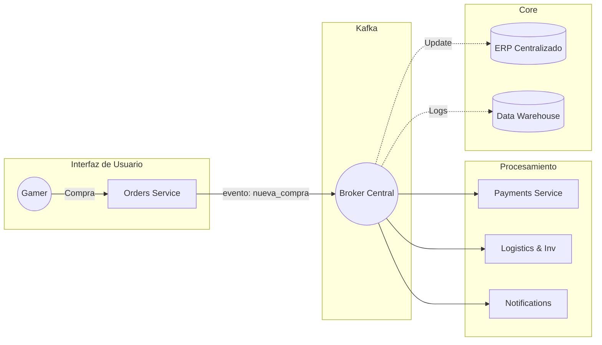

# A1) Arquitectura aplicada al caso: "El Patito Feliz"

Para mi proyecto, elegí la empresa **"El Patito Feliz"**, que es un retail especializado en **accesorios de tecnología y gaming**. Por recomendación del ingeniero Yoel en las sesiones de arquitectura, decidimos movernos de un sistema donde todo dependía de una sola base de datos a uno **dirigido por eventos**. 

La meta es que el sistema sea asíncrono. Esto es clave para nosotros porque cuando lanzamos ofertas, el servidor de pagos a veces se satura; con esta arquitectura, la orden queda guardada en Kafka y se procesa en cuanto hay espacio, sin que el cliente vea un error en la pantalla.

## Componentes Clave:

* **System of Record (ERP Central):** Es nuestro núcleo "pesado". Aquí es donde vive la verdad sobre cuánto dinero tenemos y cuántos teclados o mouses quedan en bodega. Es el sistema que manda en las finanzas.
* **Sistemas Satélite (Los nuevos microservicios):**
    * **Orders (Hono):** Este recibe la compra. Valida que el usuario tenga sesión iniciada y que los datos de la orden estén bien antes de avisarle a los demás.
    * **Inventory & Logistics:** En lugar de ser solo logística, este servicio aparta el producto en el momento que llega el evento de "orden creada" para que no se lo vendamos a nadie más.
    * **Payments Gateway:** Se queda escuchando a Kafka y, cuando ve una orden nueva, dispara el cobro con la tarjeta del cliente.
    * **Customer Alert (Notifications):** Es nuestro servicio de atención. No solo manda correos, sino que confirma por SMS cuando el pago fue aceptado.
* **BI y Analítica:** Usamos los datos que viajan por Kafka para ver qué productos se venden más en ciertas horas y así planear las ofertas del mes.

## Diagrama de Arquitectura (Mermaid)

# A2) Gobierno de TI (COBIT — Mínimo Viable)
En El Patito Feliz, no queremos que el sistema sea un caos donde cualquiera mueve cables o borra bases de datos. Por eso, usamos COBIT para poner orden en quién manda y qué reglas se siguen.

Roles y Responsabilidades
La Gerencia (Dirección): Son los que ponen la plata y nos dicen: "Oigan, el sistema no se puede caer en Navidad". Ellos aprueban el presupuesto para que Kafka corra bien.

Equipo de TI: Nosotros, los que nos encargamos de que los servicios de Hono y el Broker de Kafka estén siempre levantados.

Seguridad: Los que cuidan que los hackers no se metan a ver cuánto pagó un cliente o a robarse la base de datos.

Dueño del Proceso (Ventas y Bodega): La gente que sabe cómo funciona el negocio. Ellos nos dicen si el flujo de "orden creada" está funcionando como ellos necesitan.

6 Decisiones que tenemos bajo control
Estas cosas no se deciden "a lo loco", tienen que pasar por un filtro:

¿Quién tiene la razón?: El ERP siempre tiene la última palabra sobre cuánto stock queda de un producto.

Cambios en el código: Nadie sube nada a producción sin que otro compañero revise que el código no va a romper los servicios de Logistics o Orders.

Accesos: Decidir quién puede entrar a ver los eventos que viajan por Kafka.

Backups: Cuándo y cómo respaldamos el ERP y cuánto tiempo guardamos los mensajes en el bus de datos.

Nuevos Proveedores: Cómo elegimos si nos quedamos en la nube o si compramos servidores propios.

Formato de datos: Todos los servicios tienen que hablar el mismo "idioma" (JSON) para que Kafka no se trabe.

5 Políticas (Las reglas de la casa)
Seguridad de entrada: Todo el que entre al sistema tiene que usar MFA (el código que te llega al cel) para asegurar que es quien dice ser.

Cero cambios directos: Está prohibido tocar el sistema que ya está funcionando; primero se prueba en una "copia" para ver que no falle.

Respaldo real: No solo hacemos copias de seguridad del ERP, sino que una vez al mes probamos si de verdad funcionan para recuperar los datos.

¿Qué hacer si algo falla?: Si Kafka o el ERP se caen, tenemos un plan de emergencia para avisar a todos y arreglarlo rápido.

Revisión de proveedores: Cada cierto tiempo checamos si las empresas que nos dan el servicio de nube siguen siendo seguras y confiables.